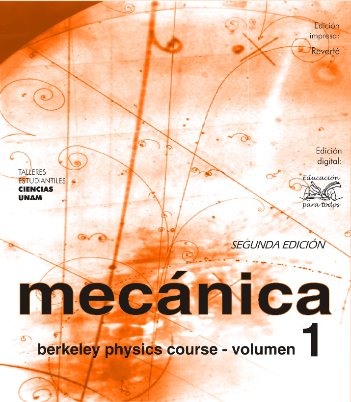

--- 
title: "Resolução do livro 'Mecánica: Berkeley Physics Course - Vol 1'"
author: "Igo da Costa Andrade"
date: "`r Sys.Date()`"
site: bookdown::bookdown_site
---

# Resolução de Problemas {-}

  KITTEL, C.; KNIGHT, W. D.; MALVIN, A. R. **Mecánica**: Berkeley Physics Course. v. 1. 2. ed. Barcelona: Reverté, 1989.
      

